# Unstained tissue 기반 Two-stage Virtual H&E 생성

> 상태: 내부 held-out WSI 평가 완료  
> 평가 해상도: **2.0 MPP**  
> 체크포인트: **Stage 1 latest epoch 805 / Stage 2 latest epoch 952**  
> 평가 코호트: **7 cases, 8 slides, 129 tissue tiles**

## 1. 프로젝트 요약

본 프로젝트의 목적은 염색 전 조직 영상(Unstained image)으로부터 가상 H&E 영상을 생성하는 것이다. Unstained 영상에는 실제 H&E에서 관찰되는 일부 세포·핵 구조가 충분히 드러나지 않기 때문에, 단일 RGB 변환 모델 대신 구조 생성과 색상 생성을 분리한 two-stage 방식을 사용했다.

**최종 파이프라인**

`Unstained RGB → global OD 변환 → Stage 1: predicted H&E OD → Stage 2: virtual RGB H&E → seamless WSI reconstruction`

- Stage 1은 Unstain OD와 H&E OD 사이의 구조 변환을 담당한다.
- Stage 2는 **Stage 1이 예측한 H&E OD만** 입력받아 H&E RGB 색상과 세부 질감을 생성한다.
- Stage 2에는 원본 Unstain OD를 concatenate하지 않는다.
- 이미지별 min-max normalization 대신 학습 데이터에서 산출한 **global OD calibration**을 사용한다.
- 모델 내부 텐서는 `[-1, 1]` 범위를 사용하며, Unstain OD 방향 반전은 하지 않는다.
- 조직 영상과 loss 계산에는 blur를 적용하지 않는다. `background_mask_blur_kernel=1`이다.

## 2. 데이터와 물리적 해상도

| 항목 | 설정 |
|---|---:|
| 원본 패치 | 2048 × 2048 px |
| 원본 해상도 | 0.5 MPP |
| 학습/평가 입력 | 512 × 512 px |
| 목표 해상도 | 2.0 MPP |
| 물리적 FOV | 1024 × 1024 μm |
| validation split seed | 42 |
| OD calibration images | 256 |
| WSI 평가 단위 | case-level aggregation |

0.5 MPP의 2048 px 영상과 2.0 MPP의 512 px 영상은 동일한 물리적 시야를 나타낸다. 따라서 현재 성능은 **세포 핵의 정밀 형태 복원보다는 2.0 MPP에서의 조직학적 H&E 표현**으로 해석해야 한다.

## 3. Stage 1 — 구조 생성

Stage 1은 1-channel 구조 CycleGAN이다. Unstain OD에서 predicted H&E OD를 생성하고, 역방향 변환과 cycle consistency를 유지한다. 잔여 정합 오차에 대해 cycle learning을 유지하면서, 사용 가능한 paired 정보는 구조 supervision에 활용한다.

주요 설정:

- Generator: ResNet, base channel 32, residual block 6
- `lambda_cycle=5.0`
- `lambda_identity=2.5`
- `lambda_paired=20.0`
- `lambda_ssim=2.0`
- `lambda_gradient=1.0`
- `lambda_background=5.0`
- Background mask blur 없음 (`kernel=1`)

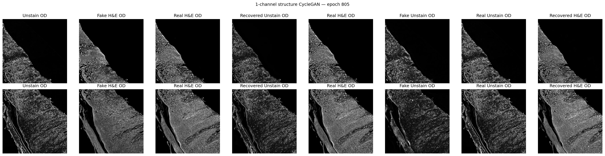

**관찰**

- 큰 조직 경계와 층상 구조는 비교적 안정적으로 유지된다.
- Recovered OD 결과에서 cycle consistency가 작동하는 것을 확인할 수 있다.
- Unstained 입력에 존재하지 않는 세포 정보를 정확히 복원했다고 단정할 수는 없다. 생성된 미세 구조는 조직학적으로 plausible한 표현일 수 있으나 개별 세포의 ground-truth recovery를 의미하지 않는다.

## 4. Stage 2 — H&E RGB colorization

Stage 2는 predicted H&E OD 한 채널만 입력받아 RGB H&E를 생성한다. 원본 Unstain 영상이나 real H&E OD에서 직접 예측한 별도 teacher 경로는 사용하지 않는다.

주요 설정:

- Input channel: 1 (`Predicted H&E OD only`)
- Base channel: 32
- Detail refinement 및 residual sharpening 사용
- `lambda_rgb=10.0`
- `lambda_ssim=2.0`
- `lambda_gradient=2.0`
- `lambda_laplacian=1.0`
- `lambda_background=10.0`
- Full-resolution 512 px에서 SSIM 계산
- Bilinear upsampling 이후 residual detail refinement
- Loss 및 출력 조직에는 blur 없음

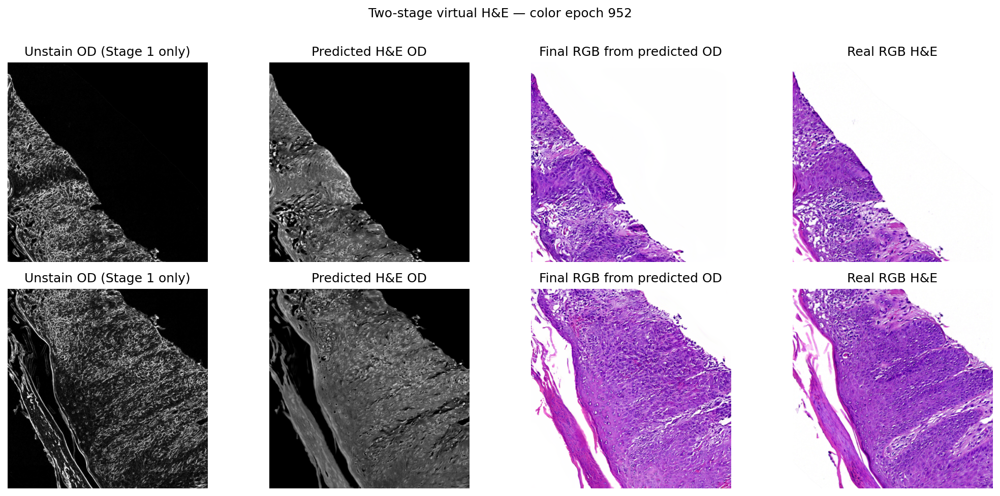

**관찰**

- 전체적인 hematoxylin/eosin 색조와 조직 영역은 real H&E에 가깝게 생성된다.
- Stage 1 구조가 불완전한 영역에서는 Stage 2가 색상을 개선할 수는 있지만 누락된 세포 정보를 검증 가능하게 복원할 수는 없다.
- 세포 수준 평가가 필요하다면 현재 2.0 MPP 결과 외에 0.5 MPP 또는 1.0 MPP 기반의 별도 고해상도 실험이 필요하다.

## 5. WSI reconstruction과 패치 격자 개선

초기 WSI는 512 px 패치를 overlap 64 px로 생성하고 각 패치에서 배경을 개별적으로 흰색 처리했다. Generator의 Instance Normalization 때문에 패치별 평균 색과 명암이 달라질 수 있으며, 좁은 overlap과 패치별 binary background 처리가 격자 및 색 연결 문제를 만들었다.

| 설정 | 기존 | 수정 후 |
|---|---:|---:|
| Tile size | 512 px | 512 px |
| Overlap | 64 px | **256 px** |
| Stride | 448 px | **256 px** |
| Blending | clipped Hanning | **flat-centre cosine** |
| Background 처리 | 패치별 | **WSI 합성 후 전역 1회** |
| TIFF JPEG quality | 90 | **95** |

수정 방식은 조직 영상을 blur하지 않는다. 겹치는 RGB 예측을 cosine weight로 합성한 후, 원본 Unstain에서 얻은 전역 배경 마스크를 최종 WSI에 한 번 적용한다.

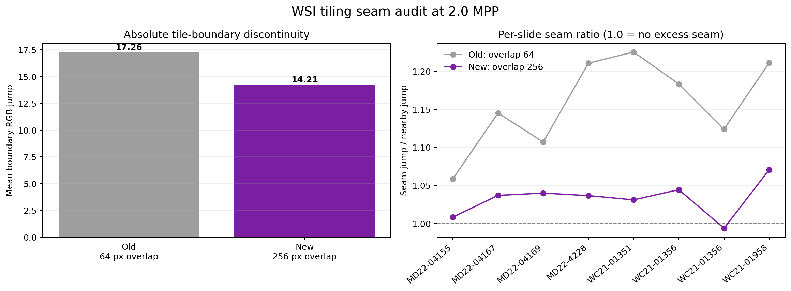

| Seam 지표 | 기존 overlap 64 | 수정 overlap 256 | 변화 |
|---|---:|---:|---:|
| Mean boundary RGB jump | 17.259 | 14.209 | **17.7% 감소** |
| Seam ratio | 1.158 | 1.033 | 경계 초과분 **약 79% 감소** |

`seam_ratio=1.0`은 타일 경계의 변화량이 주변 일반 조직 변화량과 같다는 의미다. 수정 후 8개 WSI의 seam ratio 범위는 `0.994–1.071`이었다. 50% overlap을 사용하므로 추론량이 기존보다 약 3배 증가하는 것이 주요 trade-off다.

## 6. 전체 held-out WSI 정성 결과

아래 그림은 동일한 순서로 Input Unstain, Virtual H&E, 정합된 real H&E를 보여준다.

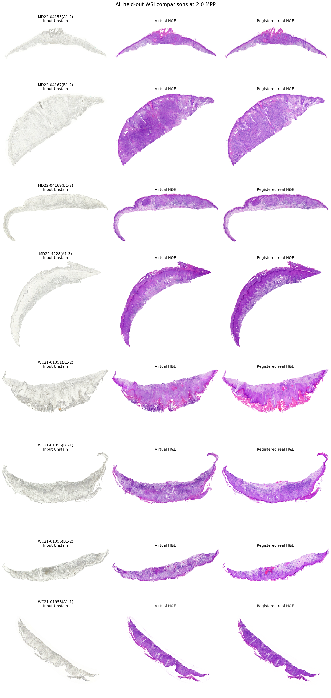

**정성적 관찰**

- 8개 WSI 모두 생성에 성공했다.
- 조직 외곽과 큰 조직학적 패턴은 real H&E와 유사하게 유지된다.
- Virtual H&E의 색상 분포는 Unstain baseline보다 real H&E에 명확히 가까워졌다.
- 일부 영역은 실제 H&E보다 균질하거나, 미세 핵 구조가 약하게 표현된다.
- WSI 수준에서 이전에 보이던 규칙적인 패치 경계는 50% overlap 합성 후 크게 감소했다.

## 7. 정량 성능

모든 지표는 2.0 MPP에서 계산했다. case 단위로 먼저 집계한 뒤 평균과 bootstrap 95% CI를 계산했다. 비교 대상인 `Unstain baseline`은 경쟁 가상염색 모델이 아니라 **입력 Unstain RGB를 real H&E와 직접 비교한 기준선**이다.

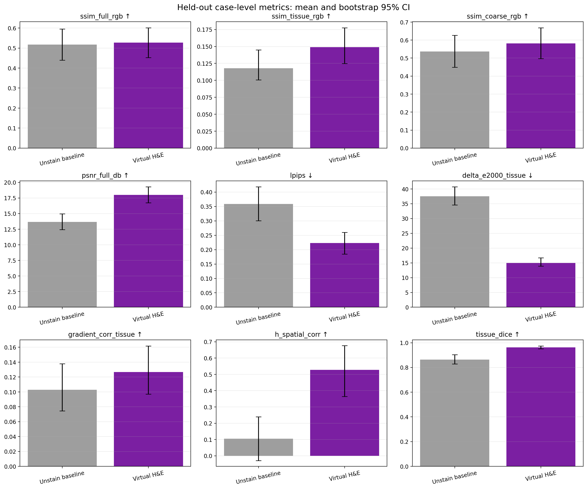

### 핵심 지표

| 지표 | Unstain baseline | Virtual H&E | 변화 | 해석 |
|---|---:|---:|---:|---|
| Full RGB SSIM ↑ | 0.518 | **0.527** | +0.009 | 전체 영상 유사도 소폭 증가 |
| Tissue RGB SSIM ↑ | 0.118 | **0.149** | +0.031 | 조직 내부 유사도 증가 |
| Coarse RGB SSIM ↑ | 0.537 | **0.582** | +0.045 | 저주파 조직 구조 개선 |
| Full PSNR ↑ | 13.67 dB | **18.01 dB** | +4.34 dB | RGB 복원 오차 감소 |
| Tissue PSNR ↑ | 10.17 dB | **14.73 dB** | +4.56 dB | 조직 영역 오차 감소 |
| Tissue MAE ↓ | 0.241 | **0.135** | −0.107 | 조직 RGB 절대오차 감소 |
| Tissue ΔE2000 ↓ | 37.54 | **15.01** | −22.53 | 색상 차이 크게 감소 |
| LPIPS ↓ | 0.358 | **0.223** | −0.135 | perceptual distance 감소 |
| H spatial correlation ↑ | 0.104 | **0.527** | +0.423 | hematoxylin 공간 분포 개선 |
| Tissue Dice ↑ | 0.864 | **0.963** | +0.099 | 조직 범위 보존 개선 |

case-paired Wilcoxon 검정 후 FDR 보정에서 Tissue SSIM, Coarse SSIM, PSNR, MAE, ΔE2000, LPIPS, H spatial correlation 및 Tissue Dice의 개선은 `q≈0.022`였다. 다만 case 수가 7개로 작기 때문에 p-value 자체보다 효과 크기, 신뢰구간, 외부 검증을 우선적으로 해석해야 한다.

### 분포 기반 지표

| 지표 | Unstain baseline | Virtual H&E | 방향 |
|---|---:|---:|---|
| FID-2048 ↓ | 232.71 | **106.80** | 개선 |
| KID mean ↓ | 0.1393 | **0.0357** | 개선 |

FID/KID는 각각 129개 타일로 계산되어 표본 수가 충분히 크지 않다. 다른 논문의 FID와 비교하려면 동일한 feature extractor, crop 크기, MPP, 전처리 및 test split이 필요하다.

### 개선되지 않았거나 주의가 필요한 지표

- Full grayscale SSIM은 `0.502 → 0.495`로 소폭 감소했다.
- Gradient correlation은 `0.103 → 0.127`로 증가했지만 FDR 보정 후 명확한 차이는 아니었다.
- Laplacian energy log error는 `0.396 → 0.582`로 악화됐다. 생성 영상의 고주파 에너지 분포가 real H&E와 완전히 일치하지 않는다는 신호다.
- Tissue SSIM 0.149는 낮아 보이지만, 서로 다른 시점의 절편 영상과 잔여 정합 오차에 민감한 지표다. 높은 background 비율을 포함한 full SSIM만 보고 성능을 주장해서는 안 된다.

## 8. Registration QC

등록 후 tissue-mask IoU `0.90`을 QC 기준으로 사용했다.

| Slide | Registration IoU | QC | Seam ratio |
|---|---:|---:|---:|
| MD22-04155(A1-2) | 0.946 | Pass | 1.008 |
| MD22-04167(B1-2) | 0.972 | Pass | 1.036 |
| MD22-04169(B1-2) | 0.970 | Pass | 1.040 |
| MD22-4228(A1-3) | 0.953 | Pass | 1.037 |
| WC21-01351(A1-2) | 0.930 | Pass | 1.031 |
| WC21-01356(B1-1) | 0.939 | Pass | 1.044 |
| WC21-01356(B1-2) | 0.868 | **Fail** | 0.994 |
| WC21-01958(A1-1) | 0.938 | Pass | 1.071 |

`WC21-01356(B1-2)`는 생성에는 성공했지만 registration QC에서 제외 대상으로 표시해야 한다. 논문 보고 시 전체 결과와 QC-pass sensitivity analysis를 함께 제시한다.

## 9. 슬라이드별 비교

각 그림의 위 행은 WSI 전체 비교, 아래 행은 조직 비율이 높은 512 px 영역의 Input / Virtual H&E / Real H&E / absolute error 비교다.

### MD22-04155(A1-2)

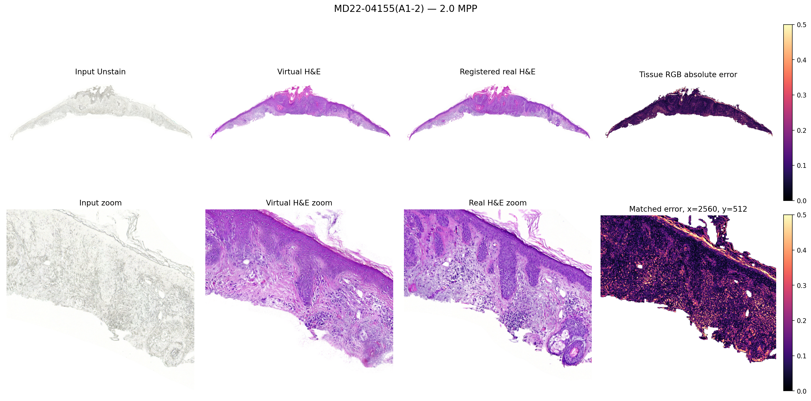

### MD22-04167(B1-2)

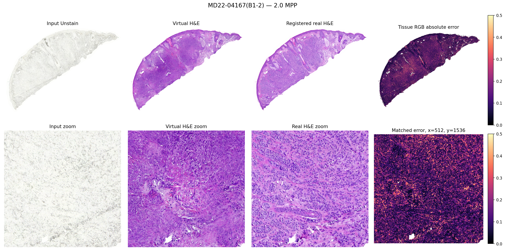

### MD22-04169(B1-2)

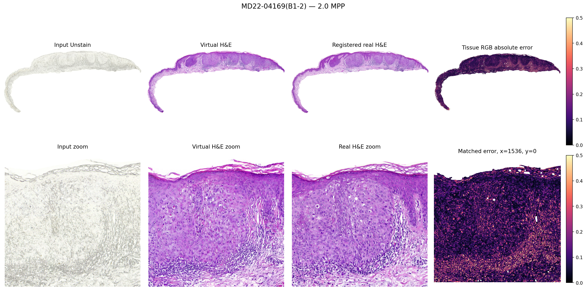

### MD22-4228(A1-3)

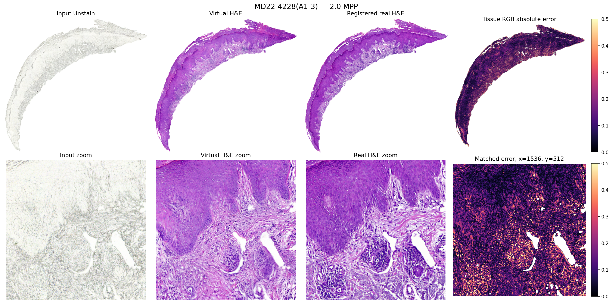

### WC21-01351(A1-2)

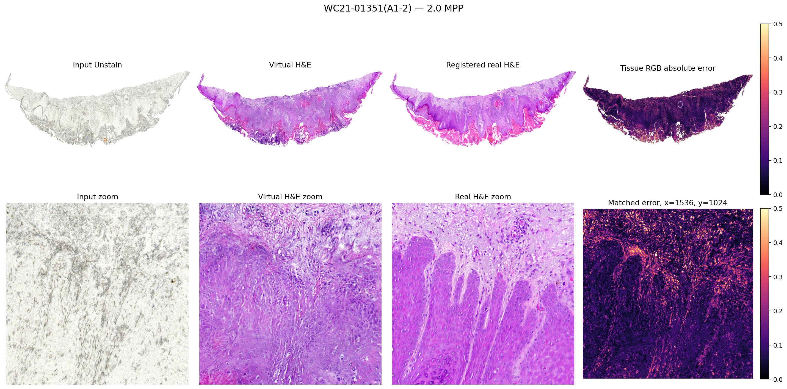

### WC21-01356(B1-1)

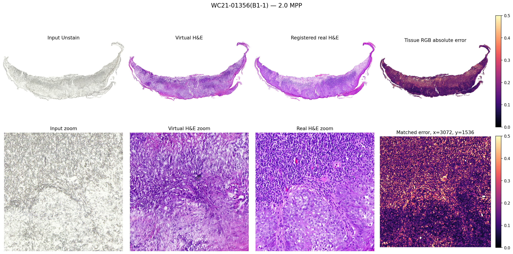

### WC21-01356(B1-2) — registration QC fail

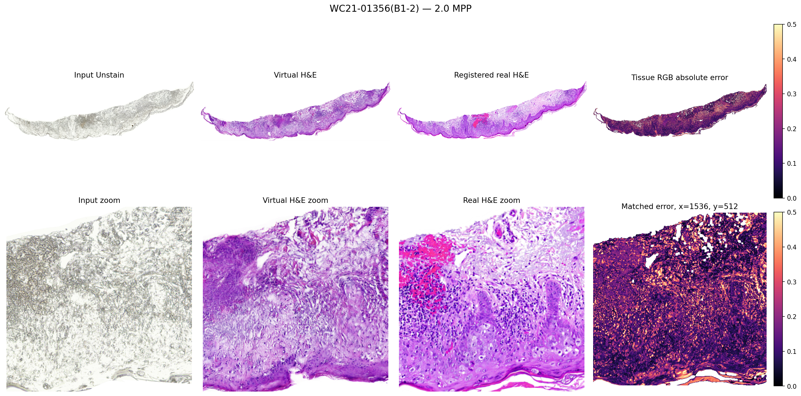

### WC21-01958(A1-1)

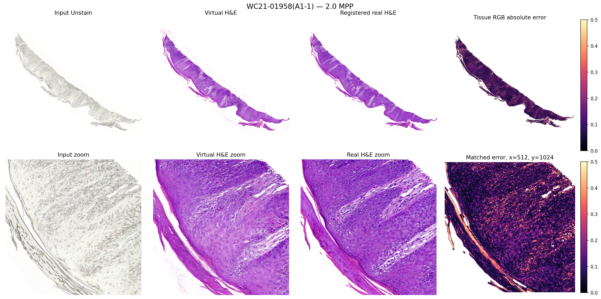

## 10. 현재 결론

현재 two-stage 모델은 2.0 MPP에서 Unstain 영상을 H&E와 유사한 조직학적 색상 공간으로 변환하고, 큰 조직 구조를 유지하는 데 의미 있는 성능을 보였다. 특히 색상 차이, perceptual distance, hematoxylin 공간 분포 및 조직 범위가 Unstain baseline보다 개선됐다. 50% cosine overlap WSI reconstruction은 패치 격자 문제도 크게 줄였다.

다만 현재 결과만으로 **누락된 실제 세포를 정확히 복원한다**, **진단적으로 real H&E를 대체한다**, 또는 **다른 논문보다 우수하다**고 결론 내릴 수는 없다. 현재 모델의 적절한 포지셔닝은 **2.0 MPP 조직학적 virtual H&E generation**이며, 세포 진위성은 별도의 고해상도 및 병리학적 검증이 필요하다.

## 11. 다음 실험 우선순위

1. 외부 기관 또는 시간적으로 분리된 독립 test cohort 평가
2. 병리의사 blinded reader study 및 real/virtual 구분 평가
3. 핵 검출·조직 분할·병변 분류 등 downstream task consistency 평가
4. Stage 1 구조 생성의 ablation: paired, cycle, SSIM, gradient, background loss
5. 0.5–1.0 MPP 고해상도 모델과 2.0 MPP 모델 비교
6. 생성된 핵 구조의 uncertainty 또는 confidence map 제공
7. Registration IoU 기준별 sensitivity analysis
8. FID/KID 계산용 test tile 수 확대 및 외부 test set 고정

## 12. 재현 경로

- 학습/테스트 노트북: `Unstain2HnE_two_stage_test_WSI.ipynb`
- WSI inference: `two_stage_inference.py`
- Batch evaluation: `two_stage_wsi_batch_evaluation.py`
- Publication metrics: `wsi_publication_evaluation.py`
- 생성 결과: `../../results/Unstain2HnE_two_stage_v4/wsi_test_all_latest_blend256`
- Stage 1 checkpoint: `../../model/Unstain2HnE_two_stage_v2/structure/latest.pt`
- Stage 2 checkpoint: `../../model/Unstain2HnE_two_stage_v4/color/latest.pt`

---

### Notion 가져오기 메모

이 Markdown 파일과 `assets/unstain2hne_wsi_report` 폴더의 상대경로 관계를 유지한 상태로 함께 압축하여 Notion의 Markdown import 기능으로 가져온다. 이미지가 누락되면 `docs` 폴더 전체를 ZIP으로 만든 뒤 import한다.
